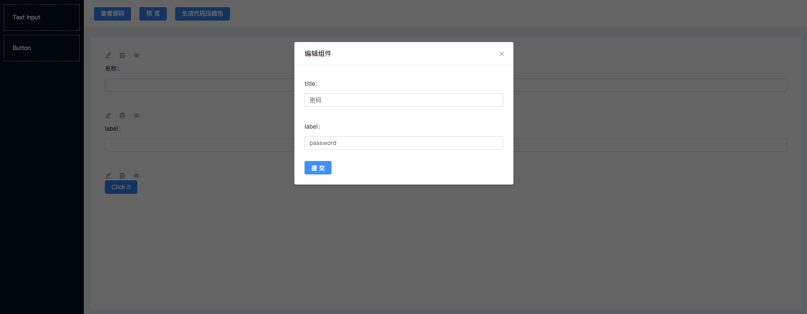

# 可视化表单搭建

项目预期是能实现所有`antd`组件的可视化搭建，目前以「表单项目」作为示例尝试能否实现。
通过简单的点击即可实现「表单项目的搭建」，最终得到的是一个压缩包，只有一个页面的`webpack`项目。

> 暂时实现简单的`Input`和`Button`组件，可以编辑「字段」的`label`和`key`，最终生成如下页面代码：
```javascript
import React, { Component } from 'react';
  import {
    Form,
    Input, Button,
  } from 'antd';
  
  import styles from './IndexPage.css';
  
  class IndexPage extends Component {
    constructor(props) {
      super(props);

      this.handleClick = this.handleClick.bind(this);
    }
    handleClick () {
      const { getFieldsValue } = this.props.form;
      const values = getFieldsValue();
      console.log(values);
      alert(JSON.stringify(values));
    }
    render() {
      const { getFieldDecorator } = this.props.form;
      return (
        <div className={styles.container}>
          <Form.Item label="名称">{getFieldDecorator("name")(<Input type="text" prefixCls="ant-input"></Input>)}</Form.Item><Form.Item label="密码">{getFieldDecorator("password")(<Input type="text" prefixCls="ant-input"></Input>)}</Form.Item><Button type="primary" onClick={this.handleClick}>Click it</Button>
        </div>
      );
    }
  }
  
  IndexPage.propTypes = {
  };
  
  export default Form.create()(IndexPage);
```



接下来实现`Input`和`Button`的所有属性支持编辑。