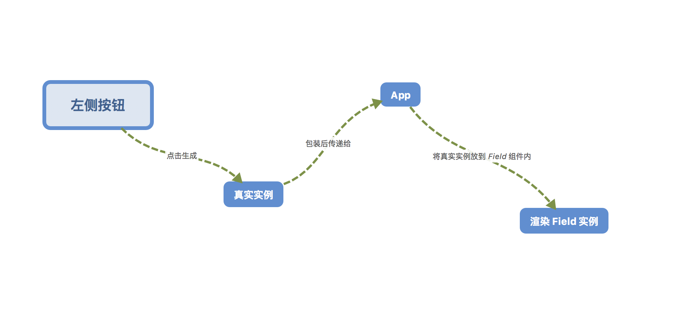

# 可视化表单搭建

项目预期是能实现所有`antd`组件的可视化搭建，目前以「表单项目」作为示例尝试能否实现。
通过简单的点击即可实现「表单项目的搭建」，最终得到的是一个压缩包，只有一个页面的`webpack`项目。

> 暂时实现简单的`Input`和`Button`组件，可以编辑「字段」的`label`和`key`，最终生成如下页面代码：
```javascript
import React, { Component } from 'react';
  import {
    Form,
    Input, Button,
  } from 'antd';
  
  import styles from './IndexPage.css';
  
  class IndexPage extends Component {
    constructor(props) {
      super(props);

      this.handleClick = this.handleClick.bind(this);
    }
    handleClick () {
      const { getFieldsValue } = this.props.form;
      const values = getFieldsValue();
      console.log(values);
      alert(JSON.stringify(values));
    }
    render() {
      const { getFieldDecorator } = this.props.form;
      return (
        <div className={styles.container}>
          <Form.Item label="名称">{getFieldDecorator("name")(<Input type="text" prefixCls="ant-input"></Input>)}</Form.Item><Form.Item label="密码">{getFieldDecorator("password")(<Input type="text" prefixCls="ant-input"></Input>)}</Form.Item><Button type="primary" onClick={this.handleClick}>Click it</Button>
        </div>
      );
    }
  }
  
  IndexPage.propTypes = {
  };
  
  export default Form.create()(IndexPage);
```


接下来实现`Input`和`Button`的所有属性支持编辑。

## 设计思路

首先要区分系统里面的组件，由于组件这个词实在太广泛了，`Button`可以称为组件、`<Button>Click it</Button>`也是组件，但这两个有很明显的区别，后者是前者的使用状态，这里姑且将前者称为「组件」，后者称为「实例」。

### Sidebar

左侧放置所有的组件，通过点击组件，将会在右侧生成对应的实例。这里用来点击的组件是对`antd`组件进行了一层包装：

```javascript
renderComponent = ({ Component, label, name, props, innerText, options }) => {
    return (
        <Component {...props}>{innerText && innerText}</Component>
    );
}
const COMPONENT_MAP = {
    Input: this.renderComponent({
        // 这里的 Input 是 antd 的 Input
        Component: Input,
        props,
    }),
    Button: this.renderComponent({
        Component: Button,
        innerText: 'Click it',
        props: Object.assign({}, props, {
            notfield: "true",
            type: 'primary',
            onClick: this.handleClick,
        }),
    }),
};
```

调用`renderComponent`后其实是得到一个实例，该实例会添加在这里声明的`props`，将这里的实例称为「真实实例」。

之所以这样做，是为了对不同组件做特殊处理，比如`Button`组件有`onClick`，`Input`有`onChange`，每个组件有其特殊之处，肯定要做一些额外的处理。

在生成实例后，会将其传递给`App.js`，即父容器，由父容器维护管理：

```javascript
// 这里是实际使用的对象
const component = {
    uuid,
    tag,
    // 这里称为 instance 会更恰当？是实际会显示在右侧预览区的
    component: COMPONENT_MAP[tag],
};

uuid += 1;
this.props.handleClick(component);
```

将这里得到的对象称为「包装对象」。

### App

在该组件内维护所有的「包装实例」，并将其渲染出来：

```javascritp
// 所有的包装对象
const { components } = this.state;

const realComponents = components.map((item, i) => {
  return (
    <Field
      key={i}
      item={item}
    >
      {item.component}
    </Field>
  );
});
```

渲染的是「真实实例」包在`Field`组件内的实例，这里称为「字段实例」，到此，页面就能够渲染出我们预期渲染的组件了。如果用流程图大概是这样的：


### Field

由该组件自身维护「真实实例」，并处理属性的编辑和代码的生成。重点就在于代码的生成，暂时是分两种情况处理，一种是表单组件，即使用`getFieldDecorator`包装后的，另一种就是正常组件。

#### 表单组件

拿`Input`来说吧，一个实例应该是这样的：

```javascript
<FormItem label="name">
    {getFieldDecorator('name')(
        <Input
          type="text"
          placeholder="请输入值"
          onChange={this.handleChange}
        />
    )}
</FormItem>
```

对应的代码应该怎么生成呢？这里是做了简单的处理，首先`Field`组件是会接收到「真实实例」和「包装对象」的，`this.props.item`即「包装对象」，所以如果在包装对象上添加字段标志是否是「表单组件」，就可以判断是否需要添加额外的代码：

```
<FormItem label="name">
  {getFieldDecorator('name')(`
```

这里倒还好，麻烦的是属性，首先点击编辑按钮可以编辑「真实实例」的属性，比如`placeholder`，问题在于我如何知道该实例有`placeholder`？虽然`Input.PropTypes`可以拿到一些属性，但没有`input`组件的属性。所以需要一个地方来添加所有支持的属性。`COMPONENT_MAP`是一个不错的地方，添加后，如何获取到呢？

